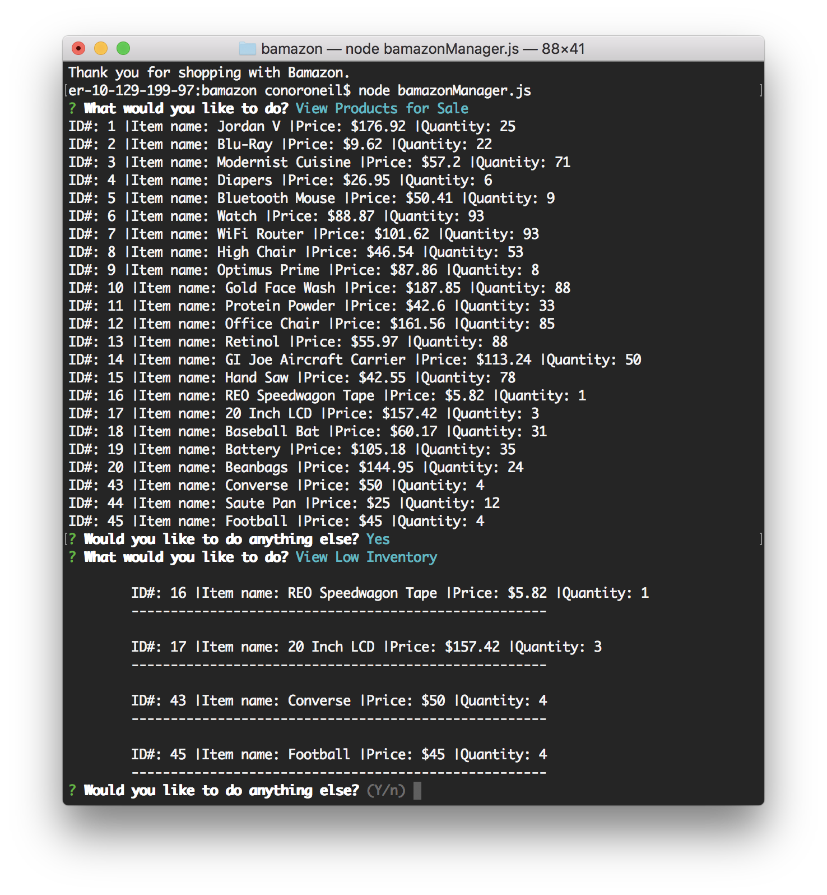

# bamazon

Open up the bamazonCustomer node app and it displays the inventory and asks the Id# you would like to buy

You choose the item and the quantity and it displays the item, price and the total price for the number of units you would like to buy

If you try to buy more than available it tells you that there is insufficient quantity.

It then asks if you would like to buy anything else if you say yes it will re-display the inventory and it takes you back through the above process. If you say no it will say thank you for shopping with bamazon.

When you run the bamazonManager node app it will ask what you would like to do and will list 4 options

View products for sale displays all the products for sale, their ID's, prices, and quantities and then ask if you want to do anything else. If you say yes it will display the original 4 menu options otherwise it thanks you for working for Bamazon.

View low inventory will display all products with inventory less than 5 then ask if you want to do anything else. If you say yes it will display the original 4 menu options otherwise it thanks you for working for Bamazon.

Add to inventory will ask the item Id you would like to add to and then the quantity you would like to add then ask if you want to do anything else. If you say yes it will display the original 4 menu options otherwise it thanks you for working for Bamazon.

Add to products will ask you the item you would like to add, the department, and the quantity to add then ask if you want to do anything else. If you say yes it will display the original 4 menu options otherwise it thanks you for working for Bamazon.

It then displays all of the products again including the new item.

When you say you don't want to do anything else.

And that's it! I may update the formatting of some of the responses but everything works!
